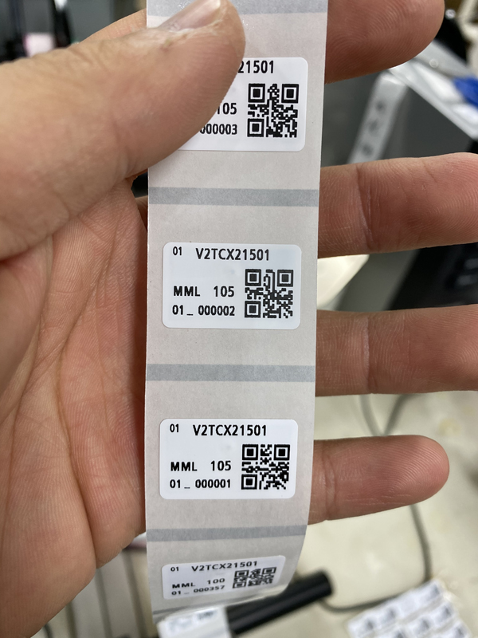

# Object Detection : printed label detection 

------------------

### This project is for detecting the mis-printed label 

#### The model detecte the printed label in real time 
- using cv2 
- detected printed label using videocam 
- finetune the pretrained objecte detection model resnet50

## Sample images 

> Correctely printed label

> Mis-printed Label

## Model 
- finetuning the model : ssd_resnet50_v1_fpn_640x640_coco17

## requirements 

`pip install -r requirements.txt`